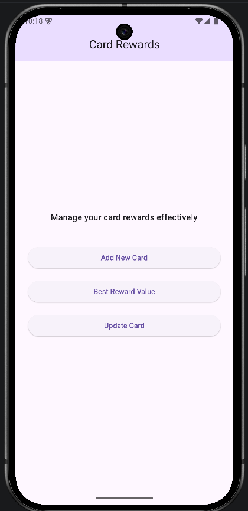
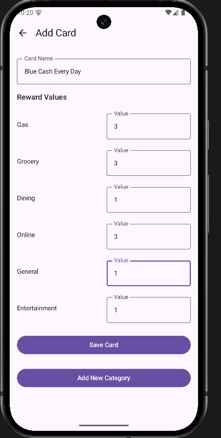
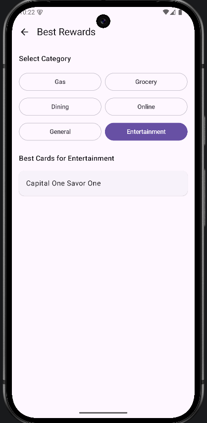
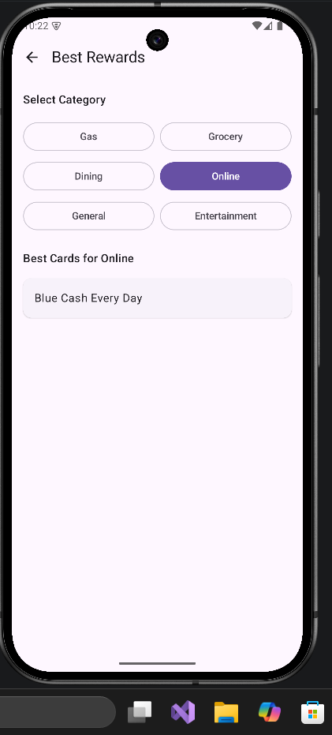

# Get Best Credit Card Android App

An Android application to help you find out which credit card of yours is best for your next purchase.

This application allows users to add their credit card names, reward categories, and reward values. When the user is ready to make a purchase, they can select a category they previously added, and the app will determine and display the best credit card to use based on the highest reward value for that category.

## Features

- Add and manage your credit cards.
- Set up custom reward categories and put in reward values for each card.
- Add new reward categories whenever you need them.
- Quickly find the best card for a category.
- Edit card names or reward values whenever they change.
- Delete cards and their reward data from the app.

## App Screenshots

## Technical Overview

- This is an Android application built using Kotlin.
- The user interface is created using Jetpack Compose and Material 3.
- The application uses a local SQLite database through Room Database.
- All credit card information and reward data are stored locally on your device to keep your data private and secure.
- Uses Jetpack Navigation to move between different screens.
- Uses Kotlin Coroutines for database operations.
- Uses KSP for the Room database compiler.

## Installation/Setup Instructions

- Users can clone or pull the repository from GitHub.
- If the user has Android Studio installed, they can open the project, build the application, generate an APK file, and install that APK on their Android device.
- In the future, an APK file may be added directly to the repository. If the APK is available, users can download it and directly install/import it onto their Android device without building the project themselves.
